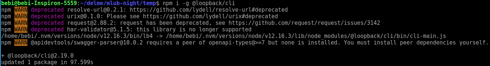
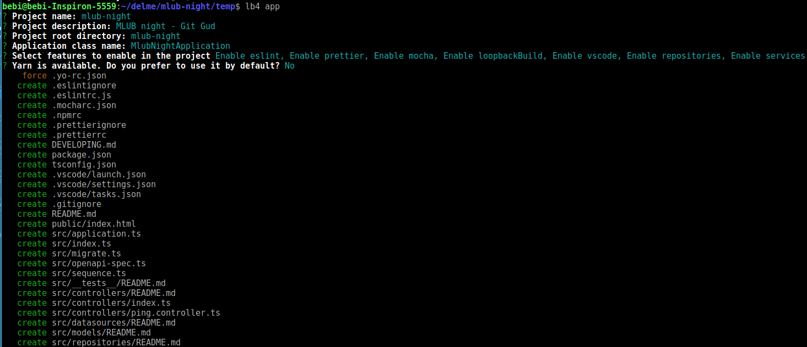
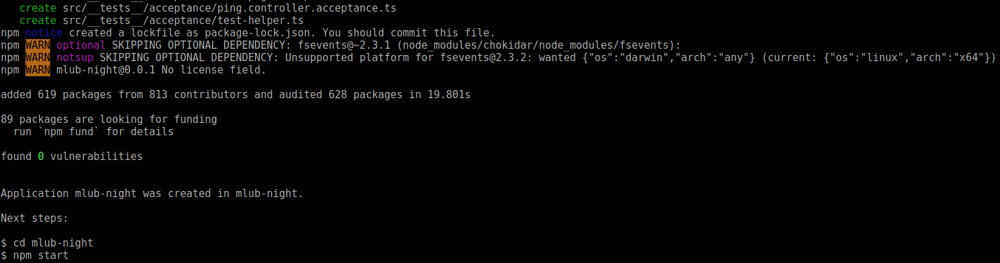
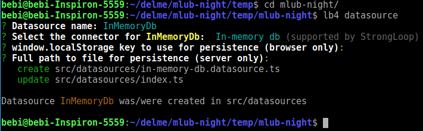
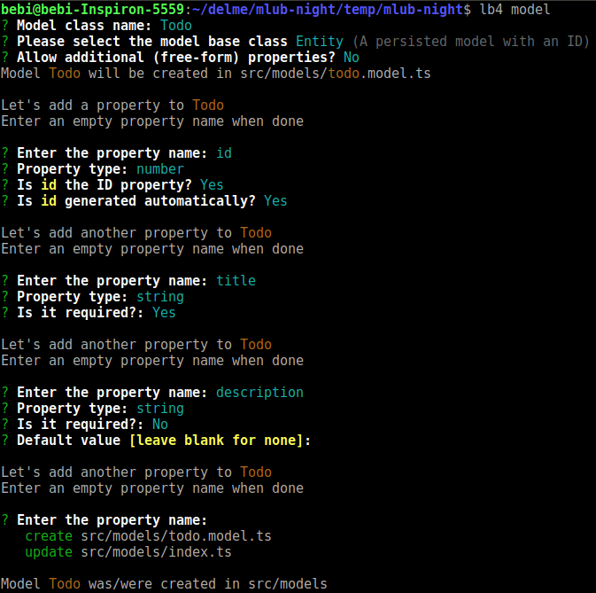
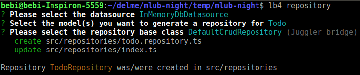
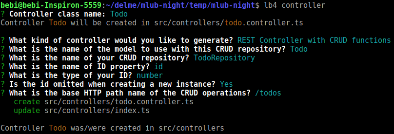

# mlub-night git gud - 2020/2/25

This application is generated using
This application is generated using [LoopBack 4 CLI](https://loopback.io/doc/en/lb4/Command-line-interface.html).

## Commands that are run
 - Install loopback CLI
   - `npm i -g @loopback/cli`
   
 - Generate loopback application
   - `lb4 app`
   
   
 - Create datasource (InMemoryDb)
   - `lb4 datasource`
   
 - Create model (Todo : id, title, description)
   - `lb4 model`
   
 - Create repository (InMemoryDb & Default CRUD)
   - `lb4 repository`
   
 - Create controller (REST)
   - `lb4 controller`
   

## Install dependencies

By default, dependencies were installed when this application was generated.
Whenever dependencies in `package.json` are changed, run the following command:

```sh
npm install
```

## Run the application

```sh
npm start
```

You can also run `node .` to skip the build step.

Open http://127.0.0.1:3000 in your browser.

## Rebuild the project

To incrementally build the project:

```sh
npm run build
```

To force a full build by cleaning up cached artifacts:

```sh
npm run rebuild
```

## Fix code style and formatting issues

```sh
npm run lint
```

To automatically fix such issues:

```sh
npm run lint:fix
```

## Other useful commands

- `npm run migrate`: Migrate database schemas for models
- `npm run openapi-spec`: Generate OpenAPI spec into a file

## Tests

```sh
npm test
```
